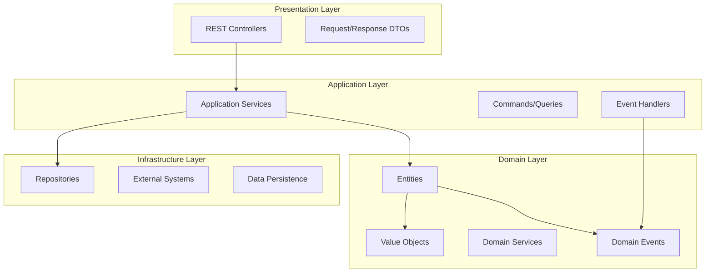
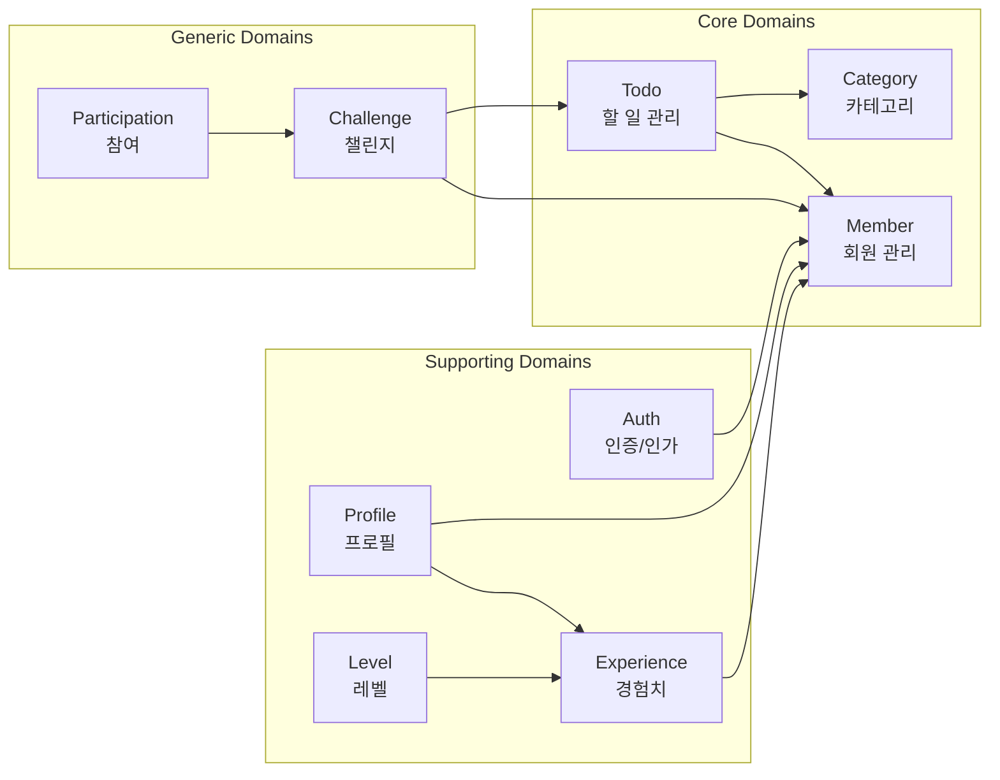
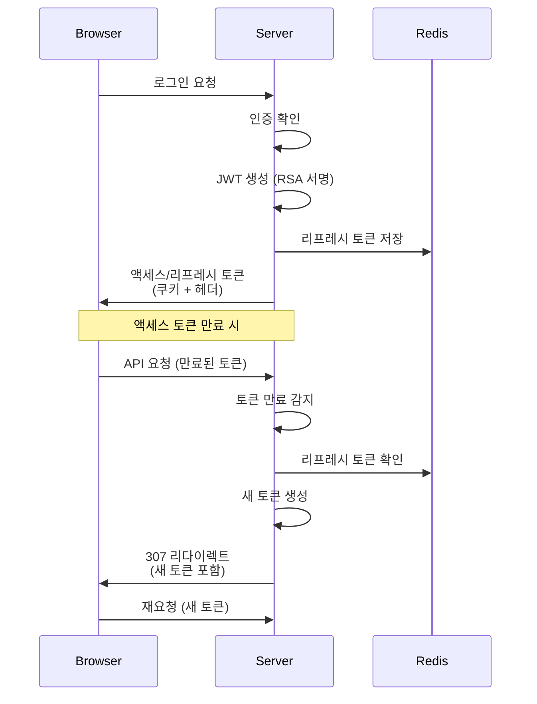
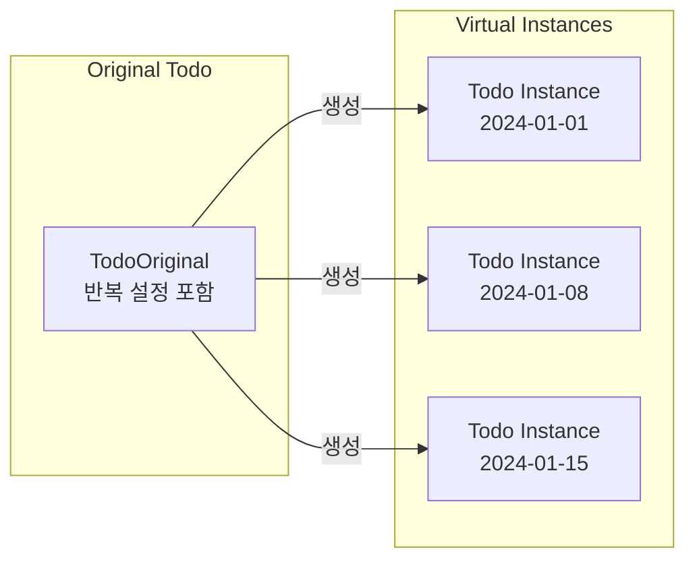
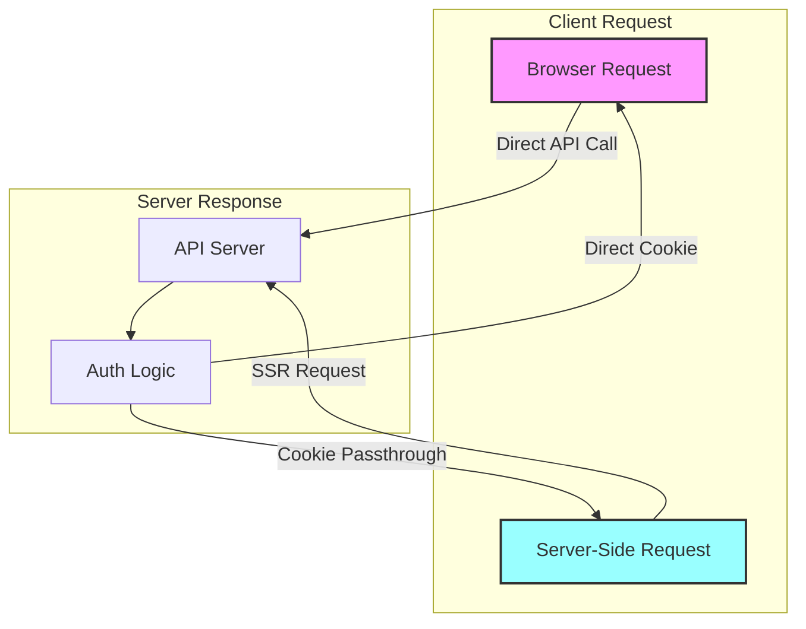

# TTODO 프로젝트 포트폴리오

## 프로젝트 개요

### 소개
TTODO는 개인 할 일 관리와 챌린지를 통한 동기부여를 제공하는 서비스입니다. 프론트엔드와 백엔드를 완전히 분리하여 점진적 향상(Progressive Enhancement)을 적용한 현대적인 웹 애플리케이션입니다.

### 핵심 가치
- **점진적 향상**: JavaScript가 비활성화된 환경에서도 기본 기능 동작
- **비용 최적화**: Cloudflare Workers의 요청 기반 과금 고려한 설계
- **선언적 UI**: HTML 기능을 최대한 활용하여 복잡도 감소
- **보안 우선**: JWT 기반 RSA 공개키 암호화 인증

### 기술 스택
#### 백엔드
- Java 21, Spring Boot 3.5.0
- PostgreSQL (메인 DB), Redis (토큰 저장소)
- Spring Security (JWT RS256)
- Docker & Docker Compose
- JUnit 5, Testcontainers

#### 프론트엔드
- SvelteKit (반응형, SSR 지원)
- Progressive Enhancement
- TypeScript

## 아키텍처 설계

### DDD(Domain Driven Design) 적용



### 도메인 구조



### 패키지 구조의 장점

1. **도메인별 패키지 분리**
   - 각 도메인이 독립적인 패키지로 구성되어 개발자의 인지 부담 감소
   - 도메인 경계가 명확하여 팀 단위 개발 시 충돌 최소화
   - 향후 마이크로서비스 전환 시 유리한 구조

2. **계층별 하위 패키지**
   - 각 도메인 내에서 DDD 계층 구조 적용
   - 의존성 방향이 명확 (Presentation → Application → Domain ← Infrastructure)
   - 테스트 작성과 모킹이 용이

3. **현실적인 타협**
   - 완벽한 DDD보다 실용성 추구
   - Common 패키지를 통한 공통 기능 재사용
   - 과도한 추상화 지양

## 주요 기능 및 기술적 특징

### 1. 인증/보안 시스템



#### 특징
- **RSA 공개키 암호화 (RS256)**: 프론트엔드가 공개키로 토큰 검증 가능
- **다중 토큰 전달**: 쿠키와 헤더 모두 지원 (브라우저/모바일 앱 호환)
- **자동 토큰 갱신**: 307 리다이렉트를 통한 투명한 갱신
- **디바이스별 관리**: 디바이스 ID 기반 리프레시 토큰 관리

### 2. 동적 쿼리 시스템

```java
// JPA Criteria API를 활용한 타입 안전 동적 쿼리
public class TodoSpecification {
    public static Specification<Todo> withFilters(
        UUID memberId, 
        List<UUID> categoryIds,
        LocalDate startDate,
        LocalDate endDate
    ) {
        return (root, query, cb) -> {
            List<Predicate> predicates = new ArrayList<>();
            
            // SQL Injection 방지를 위한 파라미터 바인딩
            predicates.add(cb.equal(root.get("memberId"), memberId));
            
            if (categoryIds != null && !categoryIds.isEmpty()) {
                predicates.add(root.get("categoryId").in(categoryIds));
            }
            
            // 날짜 범위 검색
            if (startDate != null) {
                predicates.add(cb.greaterThanOrEqualTo(
                    root.get("date"), startDate
                ));
            }
            
            return cb.and(predicates.toArray(new Predicate[0]));
        };
    }
}
```

### 3. Todo 가상 인스턴스 시스템



- **복합 키 사용**: `TodoId(originalTodoId, daysDifference)`
- **반복 할 일 지원**: 원본에서 가상 인스턴스 동적 생성
- **메모리 효율성**: 반복되는 데이터는 원본에만 저장

### 4. 점진적 향상 (Progressive Enhancement)



- **NoJS 환경 지원**: HTML Form 기반 기본 동작
- **비용 최적화**: 클라이언트 직접 요청으로 SSR 요청 감소
- **쿠키 바이패스**: SSR에서 받은 쿠키를 브라우저에 전달

## 문제점과 개선 방안

### 현재 문제점

1. **DTO 계층 미분리**
   - Presentation과 Application 계층이 같은 DTO 공유
   - 계층 간 결합도 증가

2. **일관성 부족**
   - API 경로 규칙 불일치 (일부 RPC 스타일)
   - HTTP 상태 코드 사용 불일관

3. **중복 코드**
   - Pageable, Sort 처리 로직 반복
   - 유사한 검증 로직 산재

4. **테스트 커버리지**
   - 일부 도메인 로직 테스트 부족
   - 통합 테스트 시나리오 확대 필요

### 개선 방안

1. **계층별 DTO 분리**
   ```java
   // Presentation Layer
   public record TodoRequest(String title, String description) {}
   
   // Application Layer
   public record CreateTodoCommand(String title, String description, UUID memberId) {}
   ```

2. **API 버전화**
   ```
   /api/v1/todos (RESTful)
   /api/v1/challenges/{id}/participate (리소스 중심)
   ```

3. **공통 처리 추출**
   - AOP를 활용한 페이징 처리
   - 공통 검증 유틸리티 클래스

4. **테스트 전략 개선**
   - 도메인 단위 테스트 강화
   - E2E 테스트 시나리오 추가

## 성과 및 학습

### 기술적 성과
- DDD 기반 확장 가능한 아키텍처 구축
- 점진적 향상을 통한 접근성 개선
- 비용 효율적인 클라우드 네이티브 설계

### 팀워크 성과
- 도메인별 독립적 개발로 병렬 작업 효율화
- 명확한 계층 구조로 역할 분담 용이
- 코드 리뷰 및 지식 공유 활성화

### 학습한 점
- DDD의 실무 적용과 현실적 타협점
- 보안과 사용성의 균형 잡힌 설계
- 클라우드 환경에서의 비용 최적화 전략

---

*이 프로젝트는 현대적인 웹 개발의 모범 사례를 따르면서도 실용성을 놓치지 않은 균형 잡힌 설계를 보여줍니다.*