# TTODO - 게임화된 할 일 관리 서비스

## 프로젝트 개요

TTODO는 일상의 할 일을 게임처럼 관리할 수 있는 서비스입니다. 사용자는 할 일을 완료하며 경험치를 얻고, 레벨을 올리며, 다른 사용자와 함께 챌린지에 참여할 수 있습니다.

### 핵심 기능
- 📝 **할 일 관리**: 카테고리별 할 일 생성, 반복 일정 설정, 우선순위 및 태그 관리
- 🎮 **게임화 요소**: 경험치 시스템, 레벨업, 성장 그래프
- 🏆 **챌린지 시스템**: 공개/비공개 챌린지 생성 및 참여
- 👤 **프로필 관리**: 테마 커스터마이징, 프로필 이미지 업로드

### 기술 스택
- **Backend**: Spring Boot 3.5.0, Java 21
- **Database**: PostgreSQL, Redis
- **Security**: Spring Security + JWT
- **Architecture**: DDD, 헥사고날 아키텍처
- **API**: RESTful API, SpringDoc OpenAPI
- **Infra**: Docker, GitHub Actions

## 프로젝트 아키텍처

### 전체 시스템 아키텍처

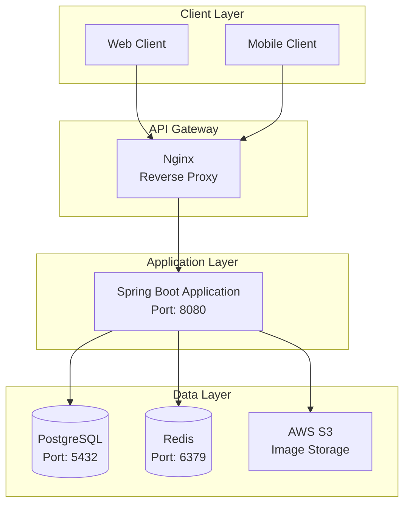

### DDD 레이어 아키텍처

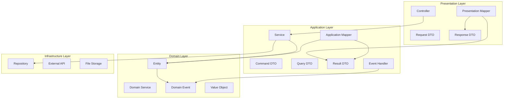

## 도메인별 상세 구조

### 1. Member (회원) 도메인

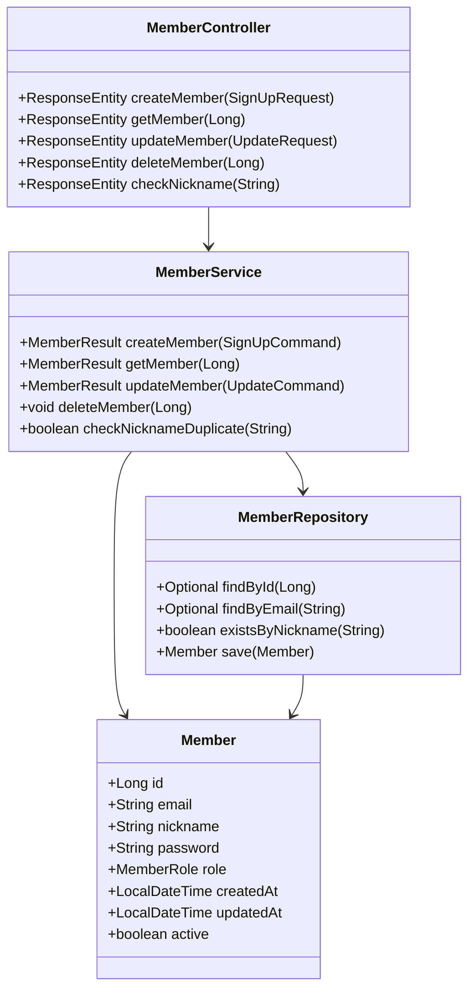

### 2. Todo 도메인

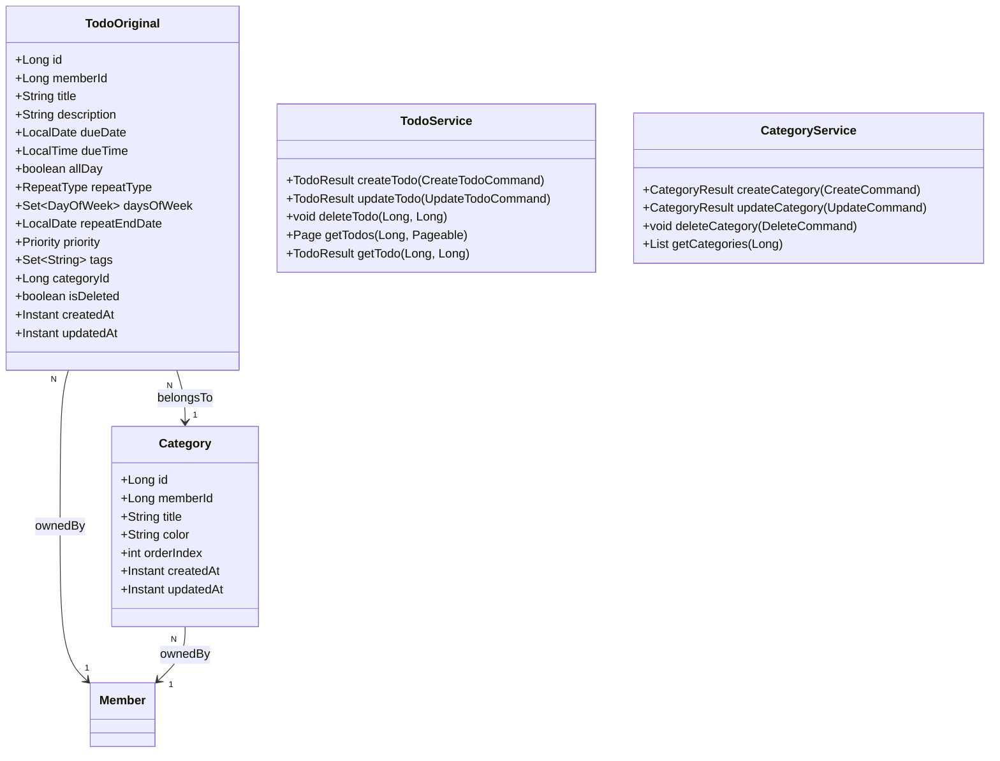

### 3. Profile 도메인

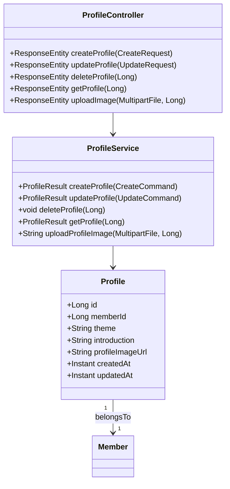

### 4. Challenge 도메인

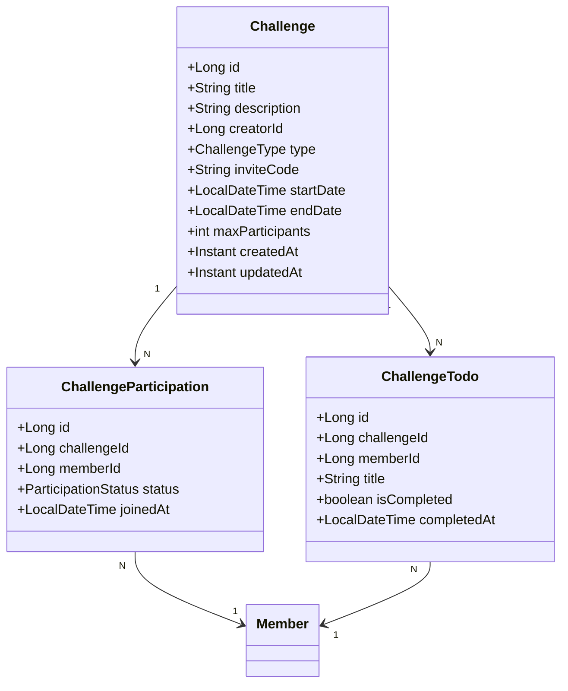

### 5. Experience & Level 도메인

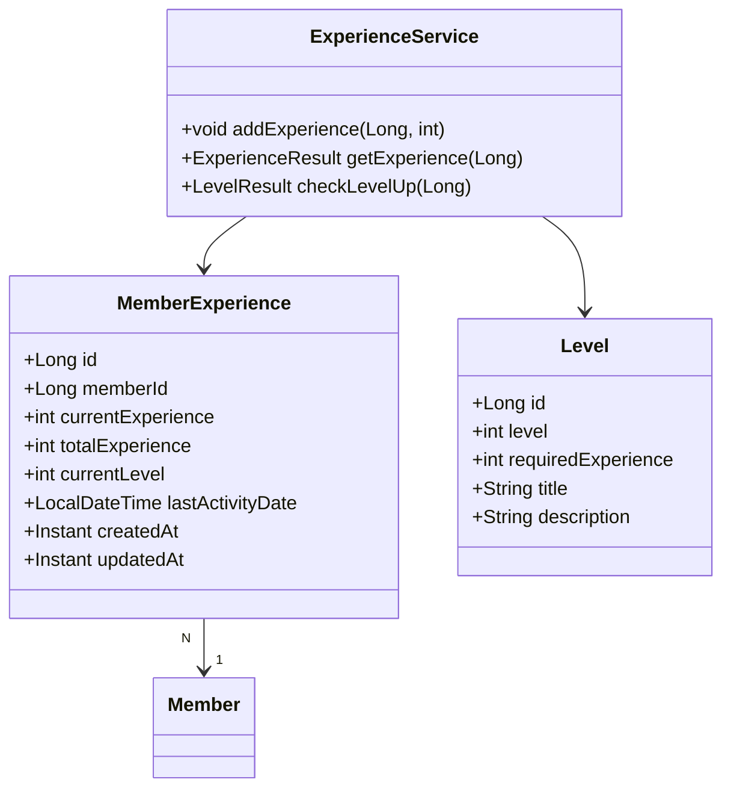

## 주요 기능 플로우

### 1. 회원가입 및 로그인 플로우

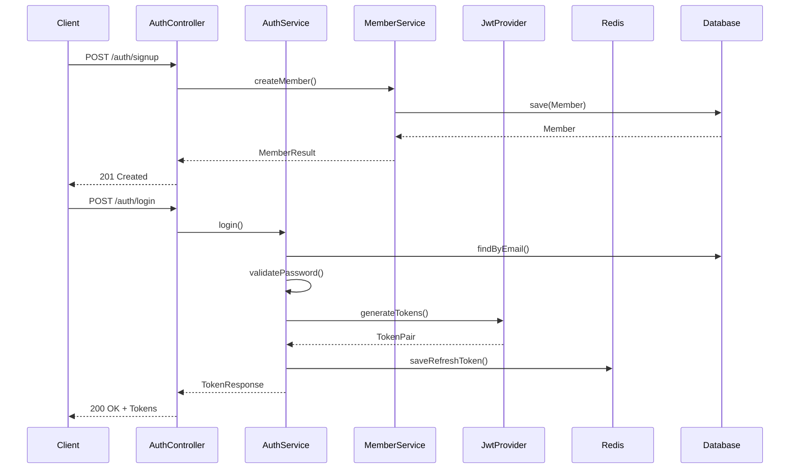

### 2. Todo 생성 및 경험치 획득 플로우

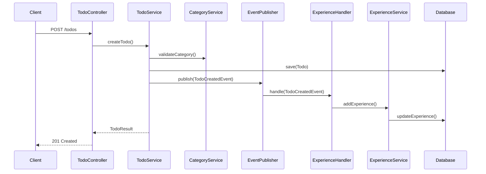

## 보안 및 인증

### JWT 토큰 기반 인증

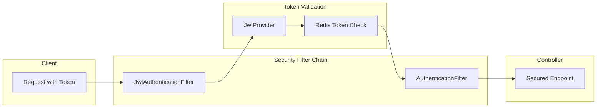

### 주요 보안 기능
- **JWT 토큰**: Access Token (30분), Refresh Token (7일)
- **Redis 세션 관리**: 토큰 블랙리스트, 리프레시 토큰 저장
- **비밀번호 암호화**: BCrypt
- **CORS 설정**: 프론트엔드 도메인 허용
- **Rate Limiting**: API 요청 제한 (준비 중)

## 성능 최적화

### 1. 데이터베이스 최적화
- **인덱스 설계**: 자주 조회되는 컬럼에 인덱스 추가
- **N+1 문제 해결**: Fetch Join, @EntityGraph 사용
- **페이징 처리**: Spring Data Pageable

### 2. 캐싱 전략
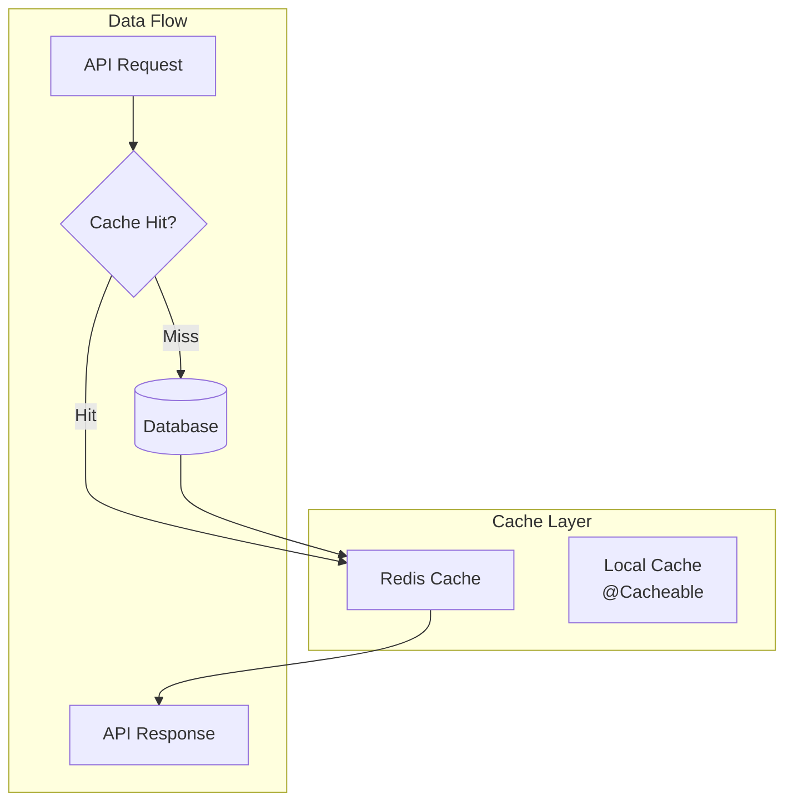

### 3. 비동기 처리
- **이벤트 기반 아키텍처**: Spring Events
- **비동기 로깅**: Log4j2 Async Appender
- **파일 업로드**: 비동기 S3 업로드

## 배포 및 인프라

### Docker Compose 구성

```yaml
services:
  app:
    build: .
    ports:
      - "8080:8080"
    environment:
      - SPRING_PROFILES_ACTIVE=prod
    depends_on:
      - postgres
      - redis
  
  postgres:
    image: postgres:15
    ports:
      - "5432:5432"
    volumes:
      - postgres_data:/var/lib/postgresql/data
  
  redis:
    image: redis:7
    ports:
      - "6379:6379"
```

### CI/CD 파이프라인

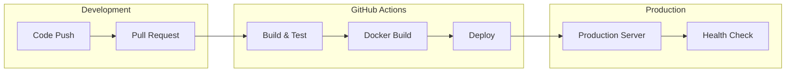

## 모니터링 및 로깅

### 로깅 전략
- **구조화된 로깅**: JSON 형식
- **로그 레벨**: ERROR, WARN, INFO, DEBUG
- **비동기 파일 로깅**: 성능 최적화
- **일별 로그 롤링**: 30일 보관

### 모니터링 (계획)
- **APM**: Application Performance Monitoring
- **메트릭 수집**: Prometheus + Grafana
- **알림**: Slack Integration

## 향후 개선 계획

### 1. 기능 확장
- [ ] 소셜 기능 강화 (친구 추가, 피드)
- [ ] AI 기반 할 일 추천
- [ ] 음성 인식 할 일 등록
- [ ] 위젯 지원

### 2. 기술적 개선
- [ ] GraphQL API 추가
- [ ] 마이크로서비스 전환
- [ ] Kubernetes 배포
- [ ] 실시간 알림 (WebSocket)

### 3. 성능 개선
- [ ] 데이터베이스 샤딩
- [ ] CDN 적용
- [ ] 검색 엔진 도입 (Elasticsearch)

## 프로젝트 성과

### 기술적 성과
- **DDD 아키텍처 구현**: 도메인 중심 설계로 유지보수성 향상
- **이벤트 기반 설계**: 도메인 간 느슨한 결합
- **테스트 커버리지**: 단위 테스트, 통합 테스트 구현
- **API 문서화**: Swagger UI 제공

### 학습 포인트
- Spring Boot 3.x와 Java 21의 최신 기능 활용
- DDD와 헥사고날 아키텍처 실전 적용
- Docker와 CI/CD를 통한 자동화 구축
- 성능 최적화와 모니터링 경험

## 프로젝트 링크
- **GitHub**: [https://github.com/GET-to-the-POINT/ttodo-api](https://github.com/GET-to-the-POINT/ttodo-api)
- **API Documentation**: [배포 후 제공 예정]
- **Demo**: [준비 중]