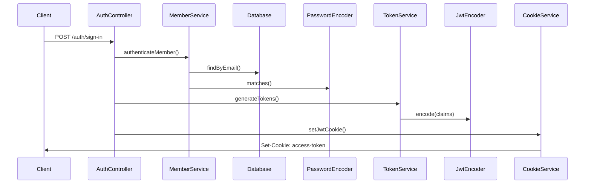
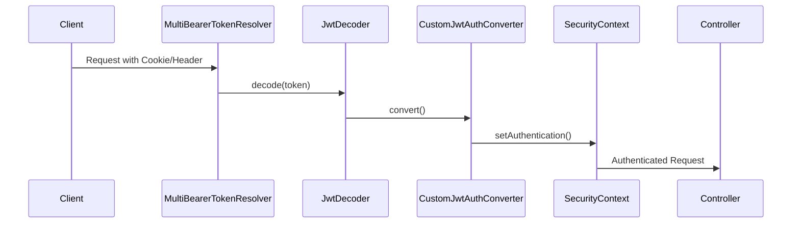

# JWT Authentication System Documentation

## Overview

TTODO-API uses a **stateless JWT-based authentication system** with HTTP-only cookies for secure token storage. The
system implements RSA-256 signing with public/private key pairs, ensuring high security and scalability.

## Architecture

### Core Components

```
┌─────────────┐     ┌──────────────┐     ┌─────────────────┐
│   Client    │────▶│ AuthController│────▶│  TokenService   │
└─────────────┘     └──────────────┘     └─────────────────┘
                            │                      │
                            ▼                      ▼
                    ┌──────────────┐     ┌─────────────────┐
                    │CookieService │     │  JwtEncoder/    │
                    └──────────────┘     │  JwtDecoder     │
                                         └─────────────────┘
```

### Authentication Flow

#### 1. Login/Signup Flow



#### 2. Request Authentication Flow



## Configuration

### JWT Properties (`application.yml`)

```yaml
jwt:
  private-key: classpath:ttodo/jwt/private.pem
  public-key: classpath:ttodo/jwt/public.pem
  key-id: rsa-key-id
  access-token:
    expiration: 60  # seconds
    cookie:
      name: access-token
      domain: 
      path: /
      secure: false  # true in production
      httpOnly: true
      sameSite: Lax
  refresh-token:
    expiration: 31536000  # 1 year
    cookie:
      name: refresh-token
      domain: 
      path: /
      secure: false  # true in production
      httpOnly: true
      sameSite: Lax
```

### Security Configuration

```java
@Configuration
@EnableWebSecurity
@EnableMethodSecurity(prePostEnabled = true)
public class SecurityConfig {
    
    @Bean
    public SecurityFilterChain filterChain(HttpSecurity http) {
        http
            .csrf(AbstractHttpConfigurer::disable)
            .sessionManagement(session -> 
                session.sessionCreationPolicy(SessionCreationPolicy.STATELESS))
            .authorizeHttpRequests(authorize -> authorize
                .requestMatchers("/auth/**").permitAll()
                .anyRequest().authenticated())
            .oauth2ResourceServer(oauth2 -> oauth2
                .bearerTokenResolver(multiBearerTokenResolver)
                .jwt(jwt -> jwt
                    .jwtAuthenticationConverter(customJwtAuthConverter)));
        return http.build();
    }
}
```

## Token Structure

### Access Token Claims

```json
{
  "sub": "user-uuid",
  "email": "user@example.com",
  "nickname": "username",
  "scope": "ROLE_USER",
  "timeZone": "Asia/Seoul",
  "locale": "ko-KR",
  "iat": 1234567890,
  "exp": 1234567950
}
```

### Token Resolution Order

1. **Authorization Header**: `Bearer <token>`
2. **Cookie**: `access-token=<token>`

The `MultiBearerTokenResolver` checks both sources in order:

```java
public String resolve(HttpServletRequest request) {
    // 1. Check Authorization header
    String token = defaultResolver.resolve(request);
    if (token != null) return token;
    
    // 2. Check cookies
    if (request.getCookies() != null) {
        return Arrays.stream(request.getCookies())
            .filter(cookie -> jwtProperties.accessToken()
                .cookie().name().equals(cookie.getName()))
            .findFirst()
            .map(Cookie::getValue)
            .orElse(null);
    }
    return null;
}
```

## API Endpoints

### Authentication Endpoints

| Method | Endpoint          | Description             | Auth Required |
|--------|-------------------|-------------------------|---------------|
| POST   | `/auth/sign-up`   | Register and auto-login | No            |
| POST   | `/auth/sign-in`   | Login with credentials  | No            |
| POST   | `/auth/sign-out`  | Logout and clear tokens | No            |
| POST   | `/auth/refresh`   | Refresh access token    | Refresh Token |
| GET    | `/auth/dev-token` | Get dev/test token      | No (Dev only) |

### Request/Response Examples

#### Sign Up

```http
POST /auth/sign-up
Content-Type: application/x-www-form-urlencoded

email=user@example.com&password=password123&nickname=TestUser

Response:
200 OK
Set-Cookie: access-token=eyJ...; Path=/; HttpOnly
Set-Cookie: refresh-token=eyJ...; Path=/; HttpOnly
```

#### Sign In

```http
POST /auth/sign-in
Content-Type: application/x-www-form-urlencoded

email=user@example.com&password=password123

Response:
200 OK
Set-Cookie: access-token=eyJ...; Path=/; HttpOnly
Set-Cookie: refresh-token=eyJ...; Path=/; HttpOnly
```

## Testing

### Test Configuration

Test environment uses different cookie names to isolate from production:

```yaml
# src/test/resources/application.yml
jwt:
  access-token:
    cookie:
      name: access-token  # Changed from test-access-token
```

### JWT Authentication Test

```java
@DisplayName("JWT 인증 테스트")
public class JwtAuthenticationTest extends BaseIntegrationTest {
    
    @Autowired
    private JwtProperties jwtProperties;
    
    @Test
    @DisplayName("헤더: 유효한 Bearer 토큰으로 인증 성공")
    public void testValidBearerTokenInHeader() {
        mockMvc.perform(get("/todos")
                .header("Authorization", "Bearer " + validAnonToken))
                .andExpect(status().isOk());
    }
    
    @Test
    @DisplayName("쿠키: 유효한 토큰으로 인증 성공")
    public void testValidTokenInCookie() {
        mockMvc.perform(get("/todos")
                .cookie(new Cookie(
                    jwtProperties.accessToken().cookie().name(), 
                    validAnonToken)))
                .andExpect(status().isOk());
    }
}
```

## Security Considerations

### Token Security

- **RSA-256 Signing**: Asymmetric cryptography for token signing
- **HTTP-Only Cookies**: Prevents XSS attacks
- **SameSite Attribute**: CSRF protection
- **Secure Flag**: HTTPS-only in production
- **Short Expiration**: Access tokens expire in 60 seconds

### Best Practices

1. Never log tokens or sensitive information
2. Use environment-specific key pairs
3. Rotate keys periodically
4. Implement token blacklisting for logout
5. Use refresh tokens for long-term sessions

## Common Issues and Solutions

### Issue: Token Not Found in Request

**Solution**: Check token resolution order and cookie configuration

### Issue: Token Expired

**Solution**: Implement automatic refresh using refresh token

### Issue: Invalid Signature

**Solution**: Verify key pair configuration and encoding

## Migration from Session-Based Auth

If migrating from session-based authentication:

1. **Current JWT Approach** (Recommended):
    - Stateless, scalable
    - No session storage required
    - Works well with microservices

2. **Traditional Spring Security** (Not suitable for JWT):
   ```java
   // DON'T use AuthenticationManager with JWT
   authenticationManager.authenticate(
       new UsernamePasswordAuthenticationToken(username, password)
   );
   SecurityContextHolder.getContext().setAuthentication(auth);
   ```

   **Why not?** JWT is stateless - no need for session-based SecurityContext

## Future Improvements

1. **Token Refresh Strategy**: Implement sliding window refresh
2. **Token Revocation**: Add Redis-based token blacklist
3. **Multi-Factor Authentication**: Add TOTP/SMS support
4. **OAuth2 Integration**: Support social login providers
5. **Rate Limiting**: Implement per-user rate limits